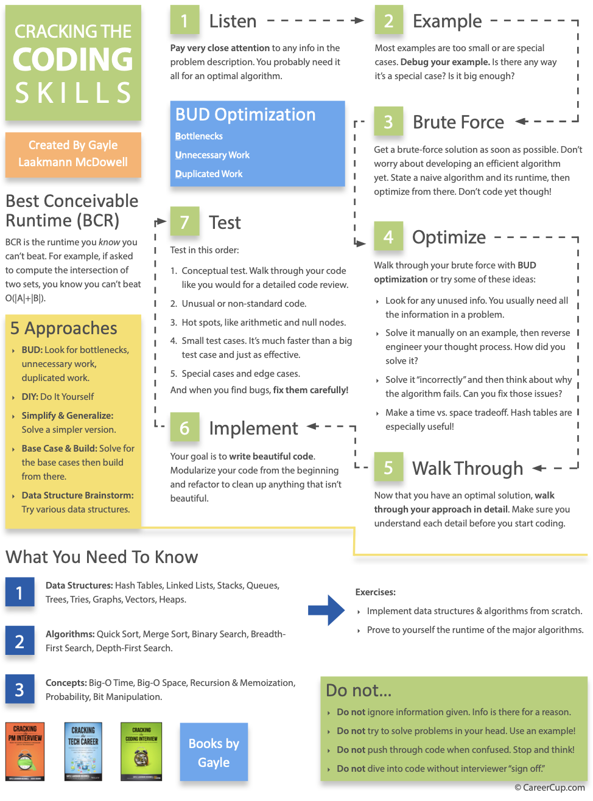

# LeetCode Archive

The following repository consists of study materials and practice problems for leetcode-type questions.

The [neetcode roadmap](https://neetcode.io/roadmap) and the [leetcode 75](https://leetcode.com/studyplan/leetcode-75/) were used to pick the problems.

## Notes on Compatibility with LeetCode Viewer repo.
Please ensure problem filenames are the same as their respective leetcode URL's to enable linking to problem when viewing in [leetcode-viewer](https://github.com/EngineerAlexander/leetcode-viewer) repository.

## Core Data Structures, Algorithms, and Concepts

| Data Structures        | Algorithms           | Concepts                |
|------------------------|----------------------|-------------------------|
| Linked Lists           | Breadth-First Search | Bit Manipulation        |
| Trees, Tries, & Graphs | Depth-First Search   | Memory (Stack vs. Heap) |
| Stacks and Queues      | Binary Search        | Recursion               |
| Heaps                  | Merge Sort           | Dynamic Programming     |
| Vectors / ArrayLists   | Quick Sort           | Big O Time & Space      |
| Hash Tables            |                      |                         |

For each of these topics, make sure you understand how to use and implement them and the space and time complexity.

## Time Complexities

log(x) < x < xlogx < x^2 < 2^x < x!

Also know common algorithms and their time complexities.

## Powers of 2 Table

| Power of 2 | Exact Value (X)   | Approx Value | X Byte Prefix |
|------------|-------------------|--------------|---------------|
| 7          | 128               |              |               |
| 8          | 256               |              |               |
| 10         | 1024              | 1 thousand   | 1 KB          |
| 16         | 65,536            |              | 64 KB         |
| 20         | 1,048,576         | 1 million    | 1 MB          |
| 30         | 1,073,741,824     | 1 billion    | 1 GB          |
| 32         | 4,294,967,296     |              | 4 GB          |
| 40         | 1,099,511,627,776 | 1 trillion   | 1 TB          |

This can be useful in interviews for seeing if integers will fit in computer memory, etc.. Remember just +-3 to the exponent to convert from bits to Bytes.

## Python Cheat Sheet

An [amazing cheat sheet](https://github.com/peterlamar/python-cp-cheatsheet) for the python programming language can be found at.

## Coding Skills

## Soft Skills

## Product Manager Skills

